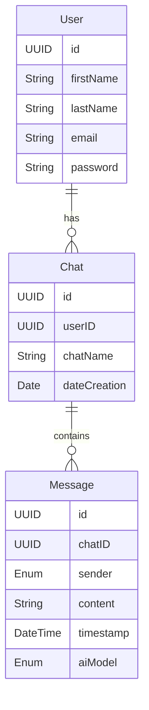

# 🌟 Hackathon 2: ¡Segunda Oportunidad para Brillar! 🌟

¡Hola, estudiantes de **DBP (Desarrollo Basado en Plataformas)**! 👩‍💻👨‍💻

Sabemos que la última hackathon no salió como esperábamos. 💔 A pesar de que contaban con el mismo reto que el ciclo pasado y podían utilizar herramientas como **ChatGPT**, **StackOverflow** o **Google**, no logramos cumplir con el objetivo. Pero aquí estamos para cambiar esa historia. 🎯✨

🚀 **¡Esta es su oportunidad de redimirse y demostrar todo su potencial!**

## 💡 **El Reto**

Esta vez, el desafío es llevar sus habilidades al siguiente nivel 💪. **¿Están listos para demostrar de qué están hechos?** Aquí va el reto:

### 🌐 **Construyan una API REST con Java Spring Boot**
1. La API debe interactuar con **Azure AI Inference SDK** para consumir modelos LLMs (Large Language Models) como **GPT-4**, **Llama**, entre otros. 🤖📡
2. Implementen los siguientes **endpoints**:
   - **Login**: Validar credenciales de usuario.
   - **Register**: Registrar nuevos usuarios.
   - **Message**: Enviar mensajes entre el usuario y la IA.
   - **Chat**: Crear y gestionar chats.  

### 🖥️ **Crea una Aplicación Web con React**
1. La aplicación debe permitir a los usuarios interactuar con la API que construyan.
2. **Objetivo:** una interfaz intuitiva, funcional y atractiva. 🌈✨

Si seleccionan un modelo multimodal, es decir, uno que acepte imágenes y texto como input, deben encontrar la manera de manejar las imágenes. Esto incluye cargar, preprocesar y enviar imágenes en el formato que el modelo espera.

## 🗂️ **Entidades y Relaciones**



## 🔗 **Endpoints**

| **Endpoint**       | **Método** | **Descripción**                                                                                      |
|---------------------|------------|------------------------------------------------------------------------------------------------------|
| `/api/register`     | POST       | Registrar un nuevo usuario en el sistema. Recibe los datos del usuario (nombre, apellido, correo, contraseña). |
| `/api/login`        | POST       | Inicia sesión en el sistema. Recibe email y contraseña.                                              |
| `/api/chats`        | GET        | Recupera todos los chats asociados al usuario autenticado.                                           |
| `/api/chats`        | POST       | Crea un nuevo chat asociado al usuario autenticado. Recibe el nombre del chat.                      |
| `/api/chats/{id}`   | GET        | Recupera los mensajes asociados a un chat específico.                                               |
| `/api/messages`     | POST       | Envía un mensaje desde el usuario a la IA o viceversa. Recibe `content`, `chatID`, y `aiModel`.      |

Nota: Los endpoints deben ser protegidos y requerir autenticación. Pueden utilizar **JWT** para manejar la autenticación.

Tip: Usen paginación para manejar grandes cantidades de mensajes.

## 🔑 **Cómo Obtener tu Token para Azure AI Inference**

### 🚀 **Get Started**

A continuación, encontrarás ejemplos de cómo configurar tu entorno y obtener tu **personal access token (PAT)** para autenticarte con el modelo.

### 1. **Crea un Personal Access Token (PAT)**

Para autenticarte con el modelo, necesitas generar un **personal access token (PAT)** en tu configuración de GitHub o configurar una clave de producción en Azure.

#### Opciones Disponibles:
- **GitHub Free**  
  Accede a la inferencia de IA usando tu PAT de GitHub. Revisa las limitaciones según tu plan.  
- **Azure AI Pay-As-You-Go**  
  Accede a inferencia bajo demanda y otros servicios de Azure AI.

#### **Importante**:
No necesitas otorgar ningún permiso al token. Ten en cuenta que el token será enviado a un servicio de Microsoft.

### 2. **Configura una Variable de Entorno**

Para usar los ejemplos de código, crea una variable de entorno y define tu token como clave para el cliente.

#### **Bash**:
```bash
export GITHUB_TOKEN="<your-github-token-goes-here>"
```

#### **PowerShell**:
```powershell
$Env:GITHUB_TOKEN="<your-github-token-goes-here>"
```

#### **Windows Command Prompt**:
```cmd
set GITHUB_TOKEN=<your-github-token-goes-here>
```

### 3. **Accede al SDK y Documentación**

Consulta los enlaces para ejemplos y más detalles:
- [Azure SDK para Java - Azure AI Inference](https://github.com/Azure/azure-sdk-for-java/tree/main/sdk/ai/azure-ai-inference)  
- [Documentación oficial de Azure AI Inference](https://learn.microsoft.com/es-es/java/api/overview/azure/ai-inference-readme?view=azure-java-preview)

## 📚 **Recursos y Herramientas Permitidas**
✅ **ChatGPT**: Pregunten, prueben, experimenten. Aprovechen al máximo la IA.  
✅ **StackOverflow**: Porque todos necesitamos una mano amiga de vez en cuando. 🧑‍🤝‍🧑  
✅ **Google**: Busquen, investiguen, aprendan. 🕵️‍♀️  
✅ **Cualquier tecnología adicional** que consideren útil para potenciar su solución. 🔧💡

## 🏆 **Criterios de Evaluación**
1. **Funcionalidad de la API**: ¿Cumple con los requisitos? ¿Es robusta? ⚙️  
2. **Integración con React**: ¿La aplicación se conecta adecuadamente con la API? 🔗  
3. **Creatividad e Innovación**: ¿Cómo sobresale tu solución frente a las demás? 🚀  
4. **Documentación y Presentación**: ¿Tu proyecto es fácil de entender y replicar? 📝  

## 💪 **¿Por qué Participar?**
- **Recupera tu nota** y demuéstrale al mundo que puedes superar cualquier obstáculo. 🌟  
- **Aprende** y experimenta con tecnologías avanzadas que están transformando la industria. 🧠  
- **Fortalece tu portafolio**: Este proyecto puede abrirte puertas en tu carrera profesional con IA Generativa. 🚪✨  
- **Demuestra tu resiliencia** y capacidad de superación. ¡Eso es lo que distingue a los verdaderos desarrolladores! 💼💥

## 🎉 **Manos a la Obra**
El tiempo corre. 🕒 ¡Es momento de poner manos al código y demostrar lo que pueden hacer! Esta segunda oportunidad no es solo una recuperación; es una invitación a superar sus propios límites. 🌌

¡Confío en ustedes! 💪✨  
🎊 **¡Vamos, estudiantes DBP! ¡Ustedes pueden hacerlo!** 🎊

> "El éxito es la suma de pequeños esfuerzos repetidos día tras día." - Robert Collier  

✨ **¡Que inicie la magia del desarrollo!** ✨